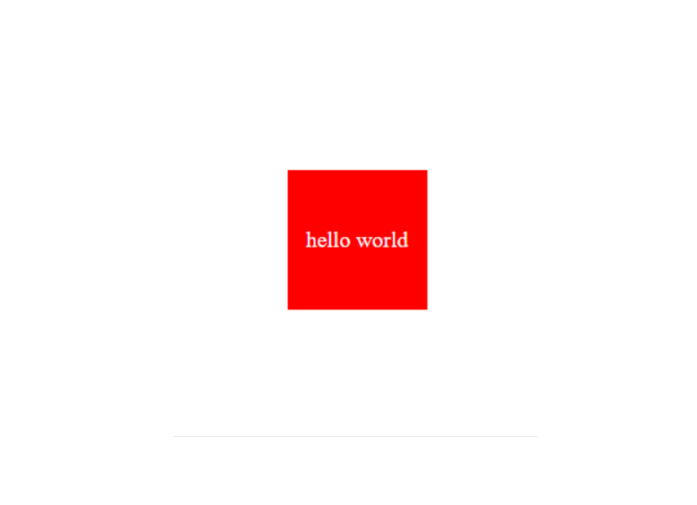

# Functionator
Learn and explore more about functions.  Select movement by key presses, run the sequence of movements. Remove movements by click on the step.

# Features
- Random phrases for typing test.
- Counts start time and end time.
- Checks for errors counts errors in words.
- Show results.

# Image

